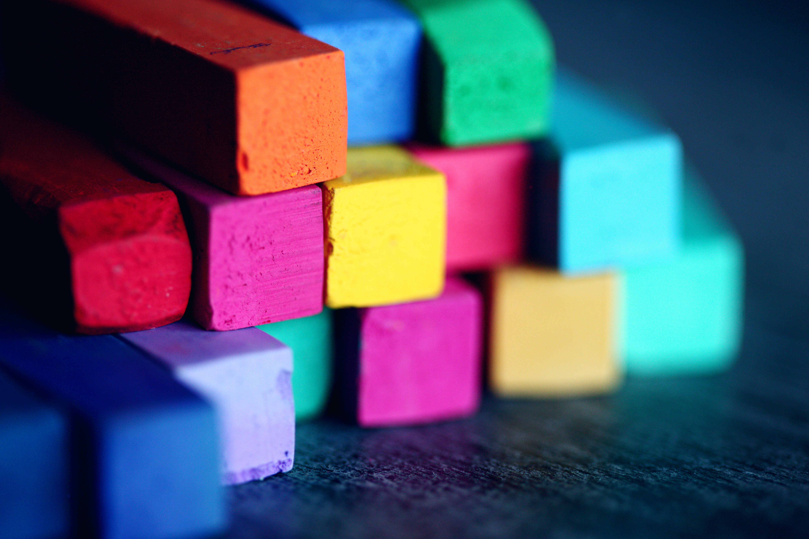
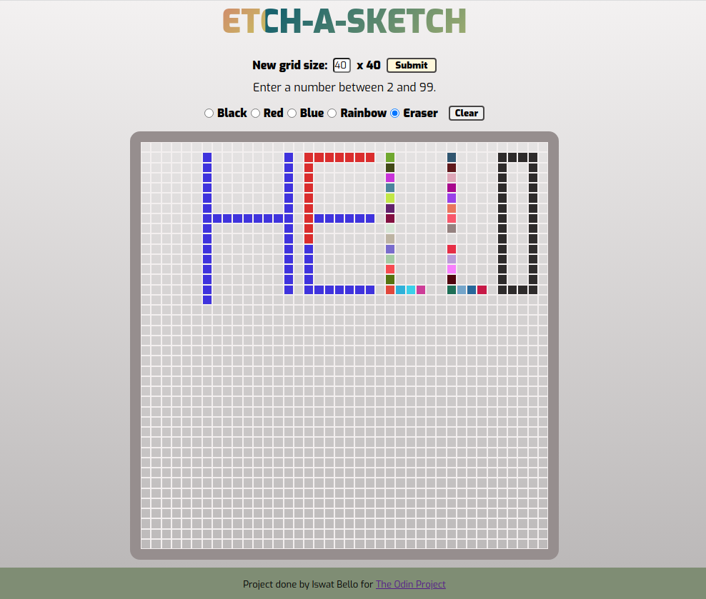

<!-- PROJECT LOGO -->
 

  

  <h3 align="center">Etch-a-Sketch</h3>

  

  This is a freestyle web version drawing interface used to express creativity without any mess of clean up. 

  <h3>
    <a target="_blank" href="https://iswanna.github.io/etch-a-sketch/">
      Demo
    </a>
     | 
    <a target="_blank" href="ttps://github.com/Iswanna/etch-a-sketch">
      Solution
    </a>
  </h3>

<!-- TABLE OF CONTENTS -->

  
Table of Contents

  <ol>
    <li>
      <a href="#about-the-project">About The Project</a>
      <ul>
        <li><a href="#built-with">Built With</a></li>
      </ul>
    </li>
    <li><a href="#contact">Contact</a></li>
    <li><a href="#acknowledgements">Acknowledgements</a></li>
  </ol>

## About The Project

 

Hi there! This is my web page of an Etch-a-Sketch pad developed using HTML, CSS and JavaScript. This project was created for The Odin Project's Foundation Course and for me to get more familiar with DOM Manipulation.

The page was made using HTML. I used CSS for styling and implemented Flexbox to create the layout. All logic was made using Vanilla JavaScript, no framework.

### Features

- Hover to draw on sketch grid
- Draw with color black, red and blue solid colors
- Change fill color with color picker
- Use 'Rainbow' button to generate random colours
- Change sketch grid size
- Clear sketch grid

Photo by Alexander Grey: https://www.pexels.com/photo/assorted-color-bricks-1148496/